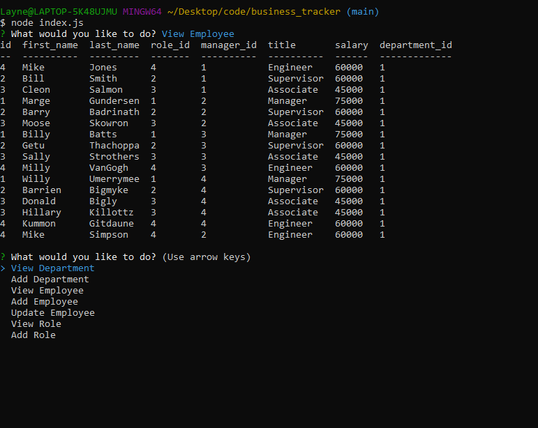

# Business Tracker

## Table of Contents
* [Description](#description)
* [Installation Instructions](#installation)
* [Usage Information](#usage)
* [Contributors](#contributor)
* [Tests](#tests)
* [License](#license)
* [Questions](#questions)

## Demo Video

https://www.youtube.com/watch?v=DbuvnEO3Q8o&feature=youtu.be

## Description
This application allows the user to track their business: departments, employyees, and their roles. It also allows them to add new departments, roles, and employees.

## Installation Instructions
Download file into node.

## Usage Information
Free to use.

## Contributors
Layne D. Hansen

## Tests 
No.

## License
MIT_license
  
 

## Questions

For questions and comments, contact me at:

Github: [LayneHansen](https://github.com/LayneHansen)

Email: laynehansen_dev@gmail.com
    
  